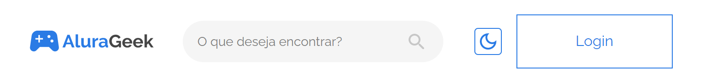
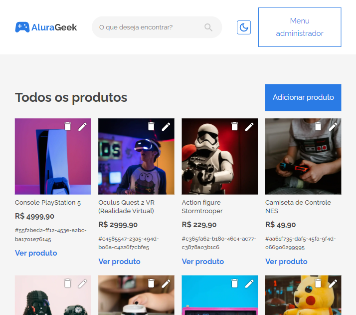
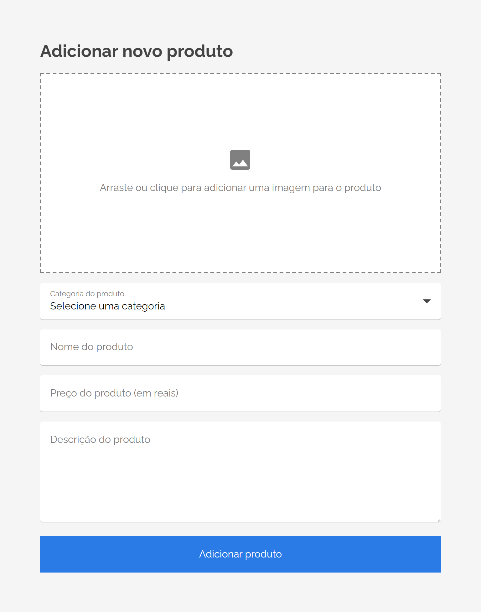
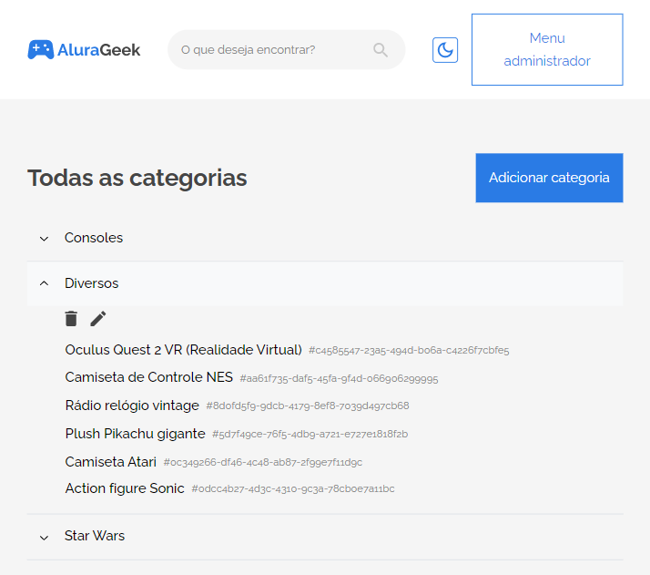
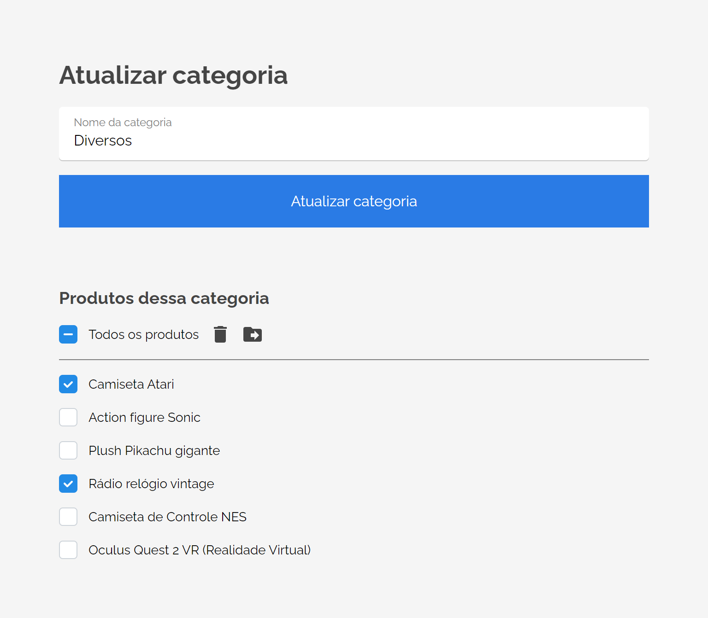

# AluraGeek &ndash; 3º Alura Challenge de Front-end

<div align="center">
  
</div>
<br />

O AluraGeek é o terceiro challenge de front-end e consiste em uma plataforma e-commerce focado em produtos do universo geek.

O desafio é uma simulação do dia a dia de trabalho de um desenvolvedor front-end. Nele, utilizamos um design feito no Figma para construir aplicação do zero com as tecnologias que preferir, baseando-se em cumprir metas semanais divididas em 4 semanas.

Quer saber mais sobre o challenge? Acesse a [página oficial](https://www.alura.com.br/challenges/front-end-3)!

Link do meu projeto: [https://alura-geek-heitorlisboa.vercel.app](https://alura-geek-heitorlisboa.vercel.app)

## ✅ Metas

- [x] Semana 1 &ndash; Concluída!
- [x] Semana 2 &ndash; Concluída!
- [x] Semana 3 &ndash; Concluída!
- [x] Semana 4 &ndash; Concluída!

## 👨‍💻 Tecnologias/serviços utilizadas

- [Next.js](https://nextjs.org) (que incluí [React](https://reactjs.org), que, por sua vez, incluí [JavaScript](https://developer.mozilla.org/pt-BR/docs/Web/JavaScript) e [HTML](https://developer.mozilla.org/pt-BR/docs/Web/HTML))
- [TypeScript](https://www.typescriptlang.org)
- [Sass](https://sass-lang.com) (que incluí [CSS](https://developer.mozilla.org/pt-BR/docs/Web/CSS))
- [CSS Modules](https://github.com/css-modules/css-modules)
- [Mantine](https://mantine.dev)
- [Prisma ORM](https://www.prisma.io)
- [Cloudinary](https://cloudinary.com) (hospedagem de imagens)
- [PlanetScale](https://planetscale.com) (hospedagem de banco de dados [MySQL](https://www.mysql.com))
- [GitHub OAuth](https://docs.github.com/pt/developers/apps/building-oauth-apps/creating-an-oauth-app) (provedor de autenticação)

## ✨ Features

- Login com GitHub
- [CRUD](## "Create, Read, Update, Delete") de produtos e suas categorias
- [SSG](## "Static Site Generation"), [ISR](## "Incremental Static Regeneration") e [SSR](## "Server Side Rendering")
- Revalidação de páginas estáticas por demanda
- Interface acessível e fácil de usar
- Sistema de busca de produtos
- Temas claro e escuro

## ❓ Como utilizar
### 💻 Inicializando localmente
#### Pré-requisitos
- [Git](https://git-scm.com/downloads)
- [Node.js](https://nodejs.org/en/)
- [Yarn](https://classic.yarnpkg.com/lang/en/docs/install/) (instale com `npm i -g yarn`)

Primeiro, crie uma pasta, clone o repositório dentro dela e depois entre na pasta.
```sh
mkdir alura-geek

git clone https://github.com/heitorlisboa/alura-geek.git alura-geek

cd alura-geek
```

Após isso, instale as dependências da aplicação e crie um arquivo `.env` na raíz do projeto (recomendo copiar o `.env.example`).
```sh
yarn

# Para rodar esse comando no Windows use o PowerShell, WSL ou Git bash
cp .env.example .env
```

Com o arquivo criado, abra o projeto com seu editor de código favorito, depois, abra o arquivo `.env` e substitua os valores de exemplo das variáveis de ambiente pelos seus.

Guias úteis para essa operação:
- [Variáveis de ambiente do NextAuth.js](https://next-auth.js.org/configuration/options)
- [Cadastrando um app OAuth GitHub](https://docs.github.com/pt/developers/apps/building-oauth-apps/creating-an-oauth-app)

**Nota**: As informações para preencher as variáveis de ambiente referentes ao Cloudinary estão disponíveis na página de Dashboard do seu perfil do Cloudinary.

**É estritamente necessário configurar o Cloudinary para que essa aplicação funcione sem fazer alterações.** Caso queira utilizá-la sem o Cloudinary, serão necessárias mudanças no funcionamento da API.

Não se esqueça de fazer os ajustes necessários em `prisma/schema.prisma` para o provedor de banco de dados que você registrou no arquivo `.env`.

- [Configurando banco de dados para o Prisma](https://www.prisma.io/docs/getting-started/setup-prisma/start-from-scratch/relational-databases/connect-your-database-typescript-mysql)

Depois de tudo configurado, envie o schema para o banco de dados.
```sh
yarn prisma db push
```

Esse comando já irá gerar o cliente do Prisma junto, mas caso dê algum problema, utilize o seguinte comando para gerar o cliente:
```sh
yarn prisma generate
```

A aplicação também possui uma *seed* para popular o banco de dados com produtos e categorias pré-cadastrados. Para isso use:
```sh
yarn prisma db seed
```

Se quiser adicionar alguma funcionalidade, crie uma nova branch antes de começar a editar:
```sh
git checkout -b <nome_da_branch>
```

Agora basta utilizar `yarn dev` para iniciar o ambiente de desenvolvimento, ou `yarn build && yarn start` para iniciar o ambiente de produção.

### 🌐 Utilizando o website

O website como um todo apresenta uma interface bem intuitiva de se navegar, porém vou dar algumas dicas de como funciona o painel de administrador da aplicação.

Primeiramente, para ter acesso de administrador, é necessário se autenticar com uma conta qualquer do GitHub. Para isso, clique no botão de login no cabeçalho da página e depois clique em *Fazer login com GitHub*.

<div align="center">
  
</div>
<br />

Depois de autenticado, você será redirecionado à página de gerenciamento de produtos (também é possível acessar essa página através do botão *Menu administrador* no cabeçalho da página, substituíndo o botão de login). Nessa página há um botão para adicionar um novo produto, e botões para editar e para excluir cada um dos produtos já cadastrados.

<div align="center">
  
</div>
<br />

Ao clicar para adicionar ou editar um produto, você irá para um formulário de cadastro de produtos. Nele você fornecerá as informações e a imagem do produto e então poderá adicioná-lo ou atualizá-lo. Ao atualizar a imagem de um produto, a imagem anterior é excluída, então tenha cautela ao realizar essa ação, pois não será possível recuperar a imagem antiga através do website.

<div align="center">
  
</div>
<br />

Ao clicar para excluir um produto você será questionado se realmente deseja excluí-lo. Se confirmar, este e sua imagem serão permanentemente deletados.

**Nota**: Caso esteja clonando a aplicação para utilizá-la ou modificá-la, você pode configurar seu preset do [Cloudinary](https://cloudinary.com) (serviço utilizado para hospedar as imagens) para fazer backup das imagens.

Além de produtos, também é possível gerenciar diretamente suas categorias, criando novas, alterando seus nomes e/ou os produtos que possui e as deletando.

Para realizar tais ações, clique no botão *Menu administrador* presente no cabeçalho da página e selecione *Gerenciar categorias*. Ao fazer isso você será redirecionado a uma página onde haverá todas as categorias cadastradas e um botão para adicionar novas categorias.

<div align="center">
  
</div>
<br />

Ao clicar para adicionar uma nova categoria, somente será possível dar um nome a ela. Já ao editar uma categoria, será possível manipular todos os produtos que ela possuir, seja os deletando ou os movendo para outra categoria. Para isso basta selecionar os produtos desejados e realizar alguma dessas ações.

<div align="center">
  
</div>
<br />

Na página de gerenciamento das categorias, também é possível excluir cada uma das categorias presentes, entretanto só é possível excluir aquelas que estiverem vazias, portanto não se esqueça de editar uma categoria para mover ou deletar todos os seus produtos antes de excluí-la.

Outro ponto importante de destacar na usabilidade é que todo campo que estiver vazio no formulário ao editar um produto ou categoria terá seu valor inalterado. Somente os campos que forem preenchidos terão seus valores atualizados.

## 📄 Licença
Esse projeto utiliza a licença GNU GPL-3.0 &ndash; veja o arquivo [`COPYING`](COPYING) para mais detalhes.

Em resumo: é uma licença que permite fazer quase tudo com o projeto, com exceção de distribuir versões de código fechado (closed source).